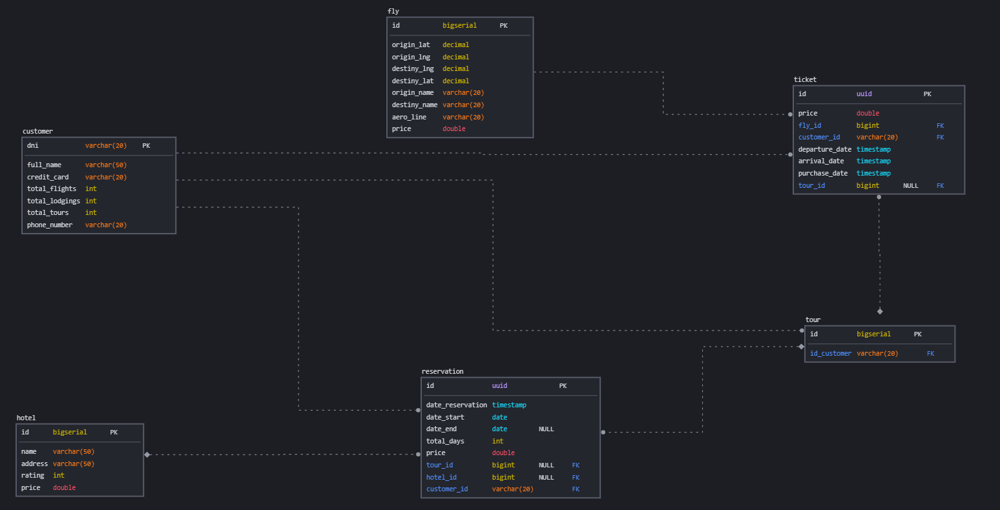
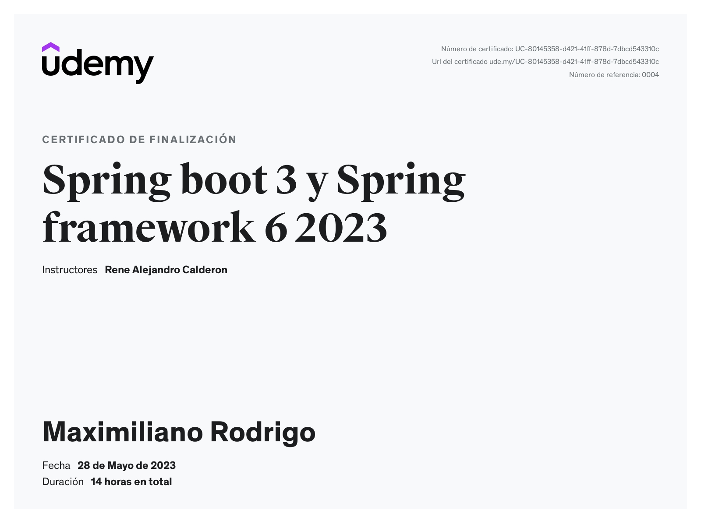

<p align="center">
<a href="https://www.linkedin.com/in/soriamaximilianorodrigo/" target="_blank" rel="noopener noreferrer">
</a></p>


<p align="center">
  <a href="#"></a>
  <a href="#"></a>
  <a href="#"></a>
</p>

<br>
<br>


## 🚀 Introducción

En este repositorio podemos encontrar el código desarrollado en el curso **Spring boot 3 y Spring framework 6 2023**

## 🔨 Build and Run

## Pre-requisitos

Se requiere que en su sistema esten instalado las siguientes herramientas:

- Java Development Kit (JDK 17)
- Maven
- Git ( para la clonación)

## Pasos

### 1. Clonar el repositorio

Para clonar el repositorio del proyecto de Spring Boot API puede usar siguiente codigo:

```bash
git clone https://github.com/MaximilianoRodrigoSoria/best-travel.git
```
```
cd best-travel
```

### 2.Construir el proyecto

Navegue hasta el directorio raíz de su proyecto y ejecute el siguiente comando de Maven para construir el proyecto:
```
mvn clean install
```

### 3. Correr la aplicacion
Una vez que la compilación sea exitosa, puede ejecutar su aplicación Spring Boot usando el siguiente comando:
```
mvn spring-boot:run
```

### 4. Para acceder a la API
Ahora debería poder acceder a su API Spring Boot en el puerto predeterminado 8080. Abra su navegador web o una herramienta como Postman y acceda a la siguiente URL:
> http://localhost:8080/best-travel/swagger-ui.html


<br>
<br>

### ⭐ DER

<p align="center">
<a href="h#" target="_blank" rel="noopener noreferrer">
</a></p>

<br>

## 📜 License

[Apache 2.0](http://springdoc.org)
---


### ⭐ Curso de Udemy

El curso de Udemy es **Spring boot 3 y Spring framework 6 2023** 


Link: https://www.udemy.com/course/spring-boot-3-y-spring-framework-6-2023/


#### Objetivo del curso

El objetivo del curso es ver los siguientes modulos:

- spring-context
- spring-boot-starter-web
- spring-boot-starter-data-jpa
- spring-boot-starter-data-mongodb
- spring-boot-starter-validation
- spring-boot-starter-mail
- spring-boot-starter-cache
- spring-boot-starter-aop
- spring-boot-starter-webflux (web client)
- spring-security-oauth2-authorization-server
- spring-security-oauth2-resource-server
- springdoc-openapi-starter-webmvc-ui

También veremos otras librerías como son:

- jackson-databind
- redisson
- apache-poi
- lombok
- java nio
- java io
- java util function
- api stream

Y utilizaremos diferentes tecnologías y bases de datos y herramientas como:

- Docker
- MongoDB
- PostgreSQL
- Redis
- Postman
- Swagger

<br/>
<br/>

### ⭐ Certificate


<p align="center">
<a href="https://www.udemy.com/certificate/UC-80145358-d421-41ff-878d-7dbcd543310c/" target="_blank" rel="noopener noreferrer">
</a></p>

> [!NOTE]
> You can access the certificate by clicking on the image.
---
<br/>

### ⭐ Autor
<br>

> ‍💻 **Name:** Maximiliano Rodrigo Soria
>
> 📧 **Email:** MaximilianoRodrigoSoria@gmail.com
>
> 🏠 **From:** Florencio Varela, Alpino
>
> 💼 **Linkedin:** [SoriaMaximilianoRodrigo](https://www.linkedin.com/in/soriamaximilianorodrigo/)
>
> 💬 **Chat:**  [Inicia un chat](https://wa.me/1127043256)


